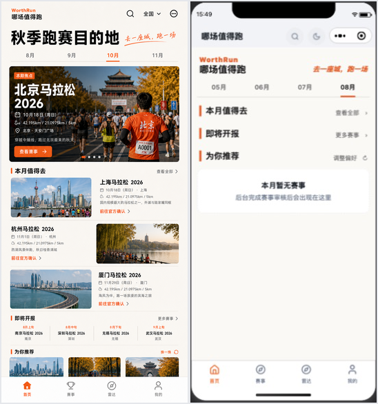
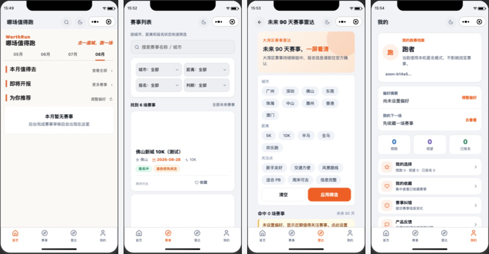

# WorthRun V0.7 设计还原审查

审查日期：2026-07-30

审查基准：已选中的“跑赛杂志 × 城市旅行”融合设计稿。

审查范围：首页、赛事列表、赛事雷达、我的、赛事详情入口，以及全局顶栏、底部导航、颜色和基础可访问性风险。

## 总体结论

当前版本完成了部分内容结构，但没有完成设计还原。首页顶栏、首页首屏和底部导航是最明显的结构性偏差；赛事、雷达、我的三个页面又分别延续了不同的旧版视觉语言，尚未形成统一的“跑赛杂志”产品。

## 证据

### 设计稿与当前首页

### 当前四个核心页面

## 分步骤审查

### Step 1：首页 — 严重偏离

- 顶栏被拆成两层：系统自定义顶栏先显示“哪场值得跑”，内容区又显示一次 WorthRun / 哪场值得跑。设计稿是一体化品牌顶栏，左侧品牌，右侧搜索、全国选择和更多。
- “全国”入口未出现在首页顶栏，反而保留了不属于设计稿主导航的夜间模式按钮。
- 设计稿的“秋季跑赛目的地”大标题、城市旅行语气和焦点赛事大图没有在当前首屏形成主视觉。
- 当前运行状态因接口不可用只显示空状态，无法验证焦点图、赛事图片和编辑推荐的实际视觉表现。
- 月份导航基本接近方向，但字号、留白、选中线长度和下方内容节奏没有对齐设计稿。

### Step 2：赛事列表 — 功能存在，视觉体系不一致

- 首屏被搜索框和四个筛选框占据，用户进入后首先看到的是“表单”，不是赛事内容；与设计稿的杂志式赛事浏览节奏不一致。
- 筛选区仍是蓝灰色后台工具风格，和首页米白、橙色、城市影像的语言脱节。
- 赛事图片加载失败时出现大面积白色空洞。开发者工具明确报告缺少 `/assets/images/event-cover-default.png`。
- 赛事卡片的图片、标题、信息和操作没有形成稳定的横向编辑卡片比例。

### Step 3：赛事雷达 — 概念与全国版冲突

- 雷达仍写“大湾区赛事雷达”，城市选项也只覆盖大湾区，与全国赛事版本直接冲突。
- 雷达是底部一级标签页，却同时显示返回箭头，导航层级自相矛盾。
- 桃色渐变头图、蓝灰标签和橙色按钮组成了另一套视觉语言，没有继承首页的米白背景、黑色大标题和杂志分隔线。
- 筛选项在一个屏幕内过密，首屏几乎看不到赛事结果。

### Step 4：我的 — 功能清楚，但仍是旧版仪表盘

- 信息分组比较清楚，想跑、观望、已报名的状态也容易理解。
- 但圆角白卡、彩色数字和密集菜单更像账户仪表盘，与首页“城市跑赛杂志”的品牌感割裂。
- 页面大量使用独立硬编码颜色，难以与全局主题统一调整。

### Step 5：赛事详情 — 当前无法完成审查

- 从赛事列表进入详情后，当前预览出现空白页，未得到可接受的稳定截图。
- 同一运行环境中还有本地接口 503 和缺失默认赛事图错误，因此目前不能确认详情页图片、顶栏、信息层级和报名操作是否符合设计稿。

## 全局问题与优先级

### P0：先修正品牌骨架

1. 把首页重复的两层头部合并成设计稿的一体化顶栏。
2. 恢复“全国”入口，重新安排搜索和更多；夜间模式移到“我的/设置”。
3. 统一底部导航背景、分隔线、图标线性风格、字号和选中态。
4. 为雷达制作独立图标，不再复用赛事图标。

### P0：让首页首屏真正成立

1. 使用设计稿的大标题、月份导航、焦点赛事大图和主按钮比例。
2. 确保无数据、图片失败和加载状态不会让首屏只剩标题列表。
3. 补齐默认赛事图，并用真实赛事图片验证裁切。

### P1：统一四个核心页面

1. 建立统一的米白背景、橙色强调、黑色标题、灰色正文、分隔线和圆角尺度。
2. 赛事筛选改为可收起，默认优先展示内容。
3. 雷达改为全国语义，并去掉一级标签页上的返回箭头。
4. 我的页面保留功能结构，但改用同一套排版、卡片和图标语言。

### P1：可访问性风险

- 顶栏搜索和主题按钮为 72rpx，约 36px，低于常见的 44px 触控目标建议。
- 当前无障碍树中存在多处“未加标签的图片”，需要区分装饰图与有意义图像并补充说明。
- 底部导航和部分状态标签主要依赖颜色区分，需要继续验证图标、文字和对比度。

## 已确认的优点

- 橙色品牌强调色已在主要操作中出现。
- 首页已具备月份、焦点赛事、本月推荐、即将开报和个性化推荐的数据结构。
- “前往官方确认”和“AI 整理，仅供参考，报名以官方为准。”仍被保留。

## 验证限制

- 本次基于微信开发者工具 iPhone 12/13 mini 视口。
- 当前本地接口存在 503，首页焦点内容和详情页无法完成视觉验收。
- 截图可以确认视觉、层级和明显触控风险，但不能单独证明完整的键盘、读屏或 WCAG 符合性。
