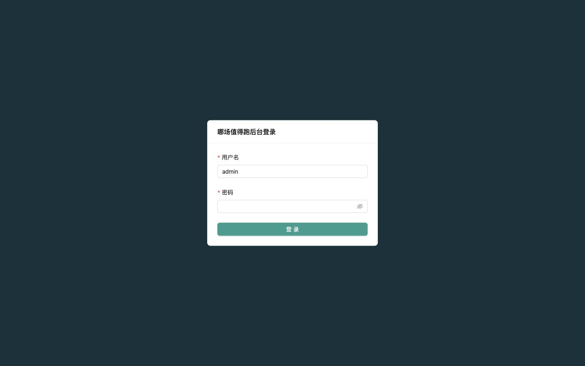
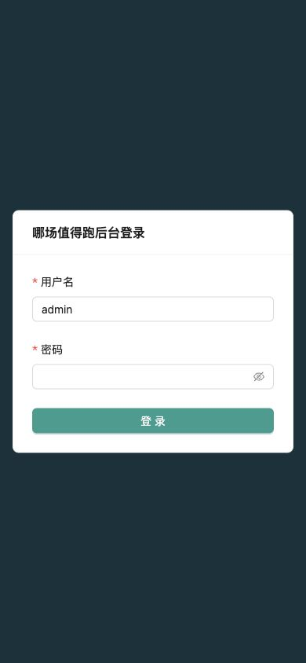
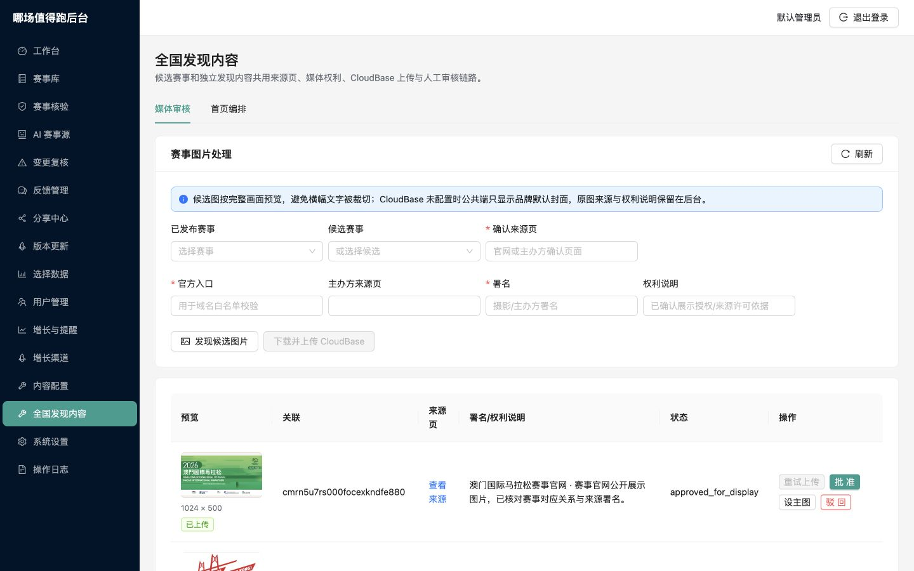
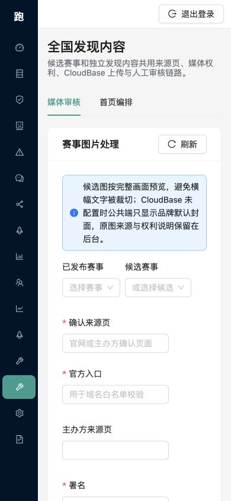

# WorthRun V0.7.1 页面与正式上线审查

审查日期：2026-07-30

## 审查范围

- 管理后台登录页：桌面与 390px 窄屏
- 管理后台“全国发现内容 / 媒体审核”：桌面与 390px 窄屏
- 赛事图片：官网横幅、标识图的完整展示、署名、尺寸与审核状态
- V0.7.1：全国地区、赛事源、候选、媒体、首页编排、雷达和生产运行状态
- 小程序：首页、赛事列表、雷达、赛事详情的源码、类型与测试；运行时视觉验收因 Mac 锁屏未完成

## 页面步骤与状态

### 1. 后台登录（桌面）— 健康

- 表单层级清楚，用户名、密码和登录按钮顺序自然。
- 画面留白稳定，没有遮挡或溢出。
- 截图不能证明完整键盘焦点顺序或屏幕阅读器兼容。

### 2. 后台登录（390px）— 健康

- 登录卡片在窄屏内完整显示，输入框和按钮保留足够宽度。
- 没有横向滚动。

### 3. 媒体审核（桌面）— 修复后健康

- 候选与已上传图片改为完整画面预览，不再用居中裁切误导审核。
- 表格展示原图尺寸、上传状态、来源、署名与权利说明。
- 修复候选接口 `pageSize=100` 超过服务端上限 50、导致整个页面数据加载失败的问题。
- 候选列表改为按 50 条自动分页，最多读取 10 页。

### 4. 媒体审核（390px）— 修复后健康

- 页面 `scrollWidth` 与视口同为 390px，没有横向溢出。
- 表单改为单列，操作按钮在窄屏换行。
- 侧栏压缩为图标导航，核心表单保持可用。
- 数据表使用自身横向滚动；截图不能证明触屏惯性滚动和所有辅助技术状态。

### 5. 小程序首页、赛事列表、雷达、赛事详情 — 运行截图待补

- 微信开发者工具已登录并打开项目，但本轮 Mac 处于锁屏状态，无法读取模拟器画面。
- 已完成小程序 TypeScript 编译、全量测试和生产 API 契约验证。
- 官网横幅和标识图会根据原始宽高使用 `aspectFit`，普通赛事照片仍使用 `aspectFill`。
- 首页焦点图和赛事标题已分层，官方图片不再被标题、按钮和渐变层遮挡。
- 赛事卡片与详情页显示图片署名；列表图片启用延迟加载。
- 在补齐微信开发者工具和真机截图前，不宣称小程序视觉验收完成。

## V0.7.1 完整性结论

### 已满足

- 最新数据库迁移已应用。
- 11 场已发布赛事的省市编码完整。
- 9 个全国中国田协官方来源全部启用、开启调度且最近运行成功，单次限制为 20 条 × 2 页。
- 3 张赛事图片均已上传、审核通过、设为主图，并保留来源、署名和完整文件标识。
- 首页编排存在 2026-07、2026-10、2026-11、2026-12 四个月份数据。
- `/health`、地区、赛事筛选、首页发现、雷达、公开详情、后台候选分页和媒体服务均通过生产验证。
- 管理后台未登录访问仍返回 401，CORS 预检返回 204。
- 76 个测试文件、340 项测试全部通过；API、后台和小程序类型检查通过。

### 正式小程序上线前仍需完成

1. 解锁 Mac 后，在微信开发者工具和至少一台真机补拍首页、赛事列表、雷达、赛事详情的窄屏与长名称状态。
2. 上传体验版前确认本地“不校验合法域名”关闭；当前 `project.private.config.json` 的 `urlCheck` 仍为 `false`。
3. 创建并人工确认 V0.7.1 用户可见更新日志；当前公开更新日志最新为 V0.6.1。
4. 完成微信体验版上传、合法域名检查、订阅消息与分享流程真机复核，再提交平台审核。

## 结论

ECS、生产 API、管理后台与 V0.7.1 服务端功能已达到上线运行条件；微信小程序正式提交审核仍有上述四项发布操作和真机视觉验收未完成。
