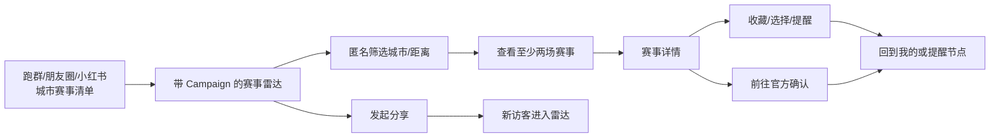

# WorthRun V0.6 大湾区赛事雷达与冷启动增长执行交接文档

> 文档日期：2026-07-28  
> 目标执行环境：ZCode / GLM-5  
> 仓库：`/Users/huangjiarong/Documents/AI/哪场值得跑/WorthRun`  
> 当前基线版本：`main` / `6e3cc8b`（交接时记录，执行前必须重新确认）  
> 文档性质：产品、研发、数据、运营一体化执行说明，不等同于完成证明

---

## 0. 给接手模型的第一条指令

请先完整阅读本文档，再检查仓库状态和现有实现。不要直接按照标题猜测需求，也不要从零重建已经存在的选择、提醒、分享和增长统计能力。

开始工作前必须执行：

```bash
cd "/Users/huangjiarong/Documents/AI/哪场值得跑/WorthRun"
git status --short
git log -5 --oneline --decorate
find .. -name AGENTS.md -print
```

执行原则：

1. 只在嵌套的 `WorthRun/` 仓库内工作，外层目录不是 Git 仓库。
2. 先阅读实际代码、Prisma schema、API 路由、共享类型和现有测试，再修改。
3. 不覆盖或提交用户本地的 `project.private.config.json`、`design/`、`promo/` 等私有或未跟踪资产。
4. 不使用 blanket staging，不要直接 `git add .`。
5. 每个里程碑独立实现、测试、记录结果；不要一次性大改后再统一排错。
6. 数据库迁移必须是非破坏性的，不删除现有用户行为、赛事、提醒、选择和分享记录。
7. 任何赛事都不得由模型凭空补齐或自动发布。公开赛事必须经过现有人工核验闸门。
8. 必须保留以下产品文案，不能改成具有交易或官方承诺含义的表达：
   - `前往官方确认`
   - `AI 整理，仅供参考，报名以官方为准。`
9. 本阶段不做全国赛事、资讯流、社区、复杂赛事 PK、奖励分享或分享解锁。
10. 若缺少生产权限、微信开发者工具或真实运营数据，必须明确标记为“外部阻塞”，不能伪造完成。

---

## 1. 项目决策

### 1.1 核心判断

WorthRun 当前的主要瓶颈是没有形成稳定的分发渠道和回访理由，不是大湾区市场容量不足。

未来四周不扩展全国，先验证：

> 大湾区跑者看到一份可信、及时、可筛选的赛事雷达后，是否愿意进入小程序、查看多场赛事、完成选赛动作，并在一周后再次回来。

### 1.2 产品定位

统一定位为：

> 大湾区跑者的可信选赛与报名节点助手。

产品不代理报名、不承诺名额、不代替赛事官方信息，也不将匿名用户选择描述为官方报名人数。

### 1.3 全国扩张门槛

只有大湾区连续两个月同时达到以下条件，才进入广东省扩张：

- MAU ≥ 1,000；
- D7 留存 ≥ 15%；
- 自然分享或合作渠道贡献 ≥ 30% 新用户。

广东省阶段验证通过后，才讨论全国化。未达到门槛时，不通过增加全国赛事数量制造虚假增长。

---

## 2. 四周成功标准

### 2.1 渠道目标

- 完成 100 个潜在合作对象的有效触达；
- 至少获得 10 个有效回复；
- 至少 3 个跑群、门店、教练或跑者账号实际转发；
- 获得 300 名独立访客；
- 至少 100 名独立访客来自可归因的外部渠道。

### 2.2 产品漏斗目标

- ≥ 40% 访客查看两场及以上不同赛事；
- ≥ 20% 访客设置城市、距离或关注点；
- ≥ 15% 访客完成至少一个核心动作：
  - 收藏；
  - 想跑 / 观望 / 已报名；
  - 设置提醒；
  - 前往官方确认；
- ≥ 8% 访客发起分享；
- 注册用户 D7 留存 ≥ 15%。

### 2.3 结果解释

| 渠道表现 | 产品行动率 | 结论 | 下一步 |
|---|---:|---|---|
| 达标 | 未达标 | 有流量但价值表达或选赛流程不足 | 修首页、雷达排序和动作引导，不扩地区 |
| 未达标 | 达标 | 产品初步成立，但渠道能力不足 | 继续跑团合作、城市清单和分享卡 |
| 达标 | 达标 | 冷启动闭环初步成立 | 进入广东省扩张评审，可启动轻量赛事 PK |
| 未达标 | 未达标 | 需求或表达尚未成立 | 暂停扩张，重新访谈，不继续堆赛事 |

不能只用分享次数、页面浏览量或赛事总数宣布成功。

---

## 3. 当前系统事实与不要重做的能力

接手时必须重新核对代码，以下是本交接版本已知现状：

### 3.1 已有能力

- 微信小程序：首页、赛事列表、赛事详情、我的；
- 赛事收藏；
- 匿名选择：想跑、观望、已报名；
- 报名节点提醒及提醒漏斗；
- 官方入口复制与行为记录；
- 用户分享 token 和分享归因；
- 管理后台增长统计；
- 赛事来源、核验时间、信息状态和人工核验机制；
- 管理员维护、来源候选、变化告警和数据治理能力。

这些能力应复用并扩展，不应另起一套相互冲突的业务模型。

### 3.2 已知缺口

1. 首页偏好查询只使用第一个城市和第一个距离，没有真正消费全部 `cities`、`distances` 和 `focusTags`。
2. 没有一个无需登录、为分享而设计的“未来 90 天赛事雷达”页面。
3. 普通用户分享 token 适合用户裂变，不适合长期运营渠道管理。
4. 现有增长统计以注册用户日行为为主，无法完整统计匿名独立访客。
5. 当前无法可靠计算“一个访客是否查看两场以上不同赛事”。
6. “设置偏好”没有进入完整的日漏斗指标。
7. 后台不能按运营渠道直接查看访问、查看两场赛事、有效选赛和新用户。
8. 历史增长快照不是当前基线，不能直接用于四周实验。

### 3.3 当前赛事数量

原计划提出公开赛事从 11 场提升到至少 30 场。`11` 是计划形成时的快照，接手后必须从当前数据库或生产公开接口重新统计：

- 未来 90 天公开赛事数；
- 未来 180 天公开赛事数；
- 按城市、距离、报名状态、来源等级、核验状态分布；
- 存在 open 变化告警或复核状态的赛事数。

统计结果写入本地运营基线，不要为了满足“30 场”而发布未经核验或虚构赛事。

---

## 4. V0.6 产品范围

### 4.1 本阶段必须交付

1. 未来 90 天赛事雷达公开页；
2. 多城市、多距离、关注点的筛选和匹配；
3. 首页四组雷达预览；
4. 持久运营渠道 Campaign；
5. 匿名访客与不同赛事浏览统计；
6. 按 Campaign 查看完整漏斗；
7. 运营触达、访谈和周报模板；
8. 至少完成一轮真实赛事供给盘点和人工核验；
9. 灰度、生产验证和可回滚机制。

### 4.2 明确不做

- 全国赛事供给；
- 新闻、动态、AI 热点或资讯流；
- 用户发帖、评论、私聊、跑团社区；
- 排行榜、投票激励、抽奖、助力；
- 分享后解锁、强制转发；
- 报名支付、代报名、名额交易；
- 复杂赛事并排 PK；
- 自动把抓取结果直接发布为赛事；
- 收集、公开跑群成员或匿名选择参与者名单。

---

## 5. 核心用户路径



关键要求：

- 从渠道进入到浏览雷达不要求登录；
- 登录或用户身份初始化失败不能阻塞公开雷达浏览；
- 筛选结果和核心赛事信息首屏可见；
- 赛事详情继续使用现有选择、收藏、提醒、来源摘要和官方确认动作；
- 分享不能依赖奖励，不得出现“助力”“解锁”“转发后查看”。

---

## 6. 雷达页面产品规格

### 6.1 页面与入口

新增原生小程序页面：

```text
pages/radar/index
```

加入 `apps/miniapp/app.json` 的页面列表，但不新增底部 Tab。

入口：

- 首页“查看未来 90 天赛事雷达”；
- 城市/距离主题分享卡；
- 带 Campaign 参数的公开路径；
- 赛事列表页的辅助入口。

推荐分享路径：

```text
/pages/radar/index?campaign=<campaign-code>&cities=广州,深圳&distances=半马,全马
```

参数必须经过白名单解析。未知或失效 Campaign 不应阻止页面打开，只是不记录该 Campaign 归因。

### 6.2 页面结构

1. 标题：`未来 90 天赛事雷达`
2. 副标题：`大湾区赛事持续核验中，报名信息请前往官方确认`
3. 城市多选；
4. 距离多选；
5. 可选关注点多选；
6. 当前命中赛事数量和生成时间；
7. 赛事分组；
8. 空状态和设置偏好引导；
9. 固定合规说明。

首版城市复用共享包中的大湾区城市常量，不在页面重新维护一份城市清单。

### 6.3 四个分组

首页和雷达页采用一致语义：

1. `本周开报`
2. `即将截止`
3. `最近确认的变化`
4. `更符合你的偏好`

如果用户没有任何偏好，第四组显示：

```text
近期值得关注
```

并提供“设置城市、距离和关注点”的轻提示，不能伪装成个性化推荐。

### 6.4 分组判定

所有分组只使用公开、未来、大湾区赛事，并遵守现有发布和信息状态限制。

#### 本周开报

满足以下任一条件：

- `signupStartAt` 在未来 7 天内；
- 当前为 `signup_open`，且 `signupStartAt` 在过去 7 天内。

#### 即将截止

满足以下任一条件：

- `signupStatus = closing_soon`；
- 当前为 `signup_open`，且 `signupDeadline` 在未来 7 天内。

#### 最近确认的变化

只能展示已被管理员应用或确认的变化：

- 对应赛事变化告警已经是 applied / resolved 的公开结果；
- 确认时间在最近 14 天内；
- 赛事当前仍可公开；
- 不返回内部告警原文、置信度、管理员备注或候选记录。

open、pending、未复核变化不得以“发生变化”对用户展示。赛事若处于来源复核中，只显示现有公开的信息状态提示。

#### 更符合你的偏好

筛选语义：

- 多个城市之间是 OR；
- 多个距离之间是 OR；
- 城市维度与距离维度之间是 AND；
- 任一维度为空代表不限制该维度；
- `focusTags` 只按规范化后的真实标签匹配，不由模型推测。

建议的确定性评分：

| 规则 | 分值 |
|---|---:|
| 城市命中 | +30 |
| 距离命中 | +25 |
| 每个关注点命中 | +10，最多 +30 |
| `runJudgement = priority` | +10 |
| `runJudgement = watch` | +3 |
| 本周开报或即将截止 | +5 |
| 信息状态已核验 | +10 |
| 来源等级为 official / trusted | +5 |
| 比赛日期在未来 30 天内 | +5 |

排序：

1. 匹配分降序；
2. 报名紧迫度降序；
3. 比赛日期升序；
4. 赛事 ID 升序，保证结果稳定。

`matchReasons` 只能由实际字段生成，例如“城市符合你的偏好”“半马距离”“近期报名截止”。不要输出“推荐报名”“一定值得跑”等替用户决策的结论。

### 6.5 重复赛事处理

API 可以返回每个赛事的全部标签，但页面主列表中同一赛事只出现一次。主分组优先级：

1. 即将截止；
2. 本周开报；
3. 最近确认的变化；
4. 更符合你的偏好。

其他命中原因以卡片 badge 展示，例如同一赛事可显示“近期有确认更新”，但不重复渲染完整卡片。

### 6.6 赛事卡片字段

雷达卡片至少展示：

- 赛事名称；
- 城市；
- 比赛日期；
- 距离；
- 报名状态；
- 可信来源名称；
- 来源等级的用户可理解表达；
- 最近核验时间；
- 信息复核状态；
- 匹配原因或节点标签；
- 进入详情按钮。

公开雷达接口不能返回：

- 管理员备注；
- 内部候选详情；
- 原始抓取 payload；
- 未处理变化告警；
- 用户标识；
- 私有来源 URL；
- 数据库内部审计信息。

---

## 7. 首页改造规格

主要文件：

```text
apps/miniapp/pages/home/index.ts
apps/miniapp/pages/home/index.wxml
apps/miniapp/pages/home/index.wxss
```

当前首页只使用 `cities[0]` 和 `distances[0]`。V0.6 必须改为：

1. 读取全部城市、距离和 `focusTags`；
2. 调用雷达预览接口；
3. 按“本周开报、即将截止、最近确认的变化、更符合你的偏好”顺序展示；
4. 每组首页最多 3 张卡片；
5. 同一赛事在首页不重复；
6. 提供完整雷达入口；
7. 无偏好时不伪装个性化；
8. 雷达接口失败时回退到当前首页赛事逻辑，不能让首页整体白屏。

保留现有视觉语言。窄屏适配必须在微信开发者工具中截图验收，不仅凭浏览器或单元测试判断。

---

## 8. API 设计

### 8.1 公开雷达接口

```http
GET /api/radar
```

查询参数：

```ts
type RadarQuery = {
  cities?: string;       // 逗号分隔，最多使用共享城市白名单中的全部城市
  distances?: string;    // 逗号分隔，只接受现有距离枚举
  focusTags?: string;    // 逗号分隔，去重后最多 10 个
  windowDays?: number;   // 默认 90，允许 30-180
  campaign?: string;     // 可选运营 Campaign code
  limitPerGroup?: number;// 默认雷达页 20，首页预览 3，上限 30
};
```

响应建议：

```ts
type RadarResponse = {
  generatedAt: string;
  window: {
    start: string;
    end: string;
    days: number;
  };
  filters: {
    cities: string[];
    distances: string[];
    focusTags: string[];
  };
  campaign: {
    code: string;
    accepted: boolean;
  } | null;
  total: number;
  groups: {
    signupOpening: RadarEventSummary[];
    closingSoon: RadarEventSummary[];
    recentlyChanged: RadarEventSummary[];
    matched: RadarEventSummary[];
  };
  complianceNotice: "AI 整理，仅供参考，报名以官方为准。";
  officialActionText: "前往官方确认";
};
```

`RadarEventSummary` 在现有 `EventSummary` 基础上增加：

```ts
type RadarEventSummary = EventSummary & {
  sourceName: string;
  sourceLevel: "official" | "trusted" | "community" | "secondary" | "unknown";
  sourceCheckedAt: string | null;
  infoStatus: string;
  primaryGroup: "closingSoon" | "signupOpening" | "recentlyChanged" | "matched";
  badges: string[];
  matchScore: number | null;
  matchReasons: string[];
};
```

接口要求：

- 单次查询取齐展示字段，避免逐赛事 N+1 查询；
- 不因没有用户身份而拒绝请求；
- 无筛选时返回可用默认雷达；
- 只返回未来且公开的赛事；
- 结果稳定、可测试；
- 查询参数长度、数量和枚举必须校验；
- 不根据 Campaign 改变赛事事实，只记录归因。

### 8.2 雷达曝光埋点

公开数据读取与行为记录不要强耦合成“接口成功即算曝光”。页面真正渲染成功后再发送：

```http
POST /api/growth/visitor-activity
```

请求示例：

```ts
{
  userKey: string;
  action:
    | "viewed_radar"
    | "viewed_event_detail"
    | "set_preference"
    | "added_favorite"
    | "set_choice"
    | "subscribed_reminder"
    | "copied_official"
    | "started_share";
  eventId?: string;
  entryPage?: string;
  campaign?: string;
  referralShareToken?: string;
}
```

要求：

- `userKey` 只用于服务端 HMAC 哈希，不保存明文；
- 不记录 IP、Cookie、浏览器指纹或设备广告标识；
- 同一访客同一日同一赛事浏览幂等；
- 非赛事动作不要求 `eventId`；
- 非法 Campaign 作为无归因访问处理；
- 埋点失败不能阻塞主业务；
- 已登录用户同时关联现有 `userId`，但匿名指标不能依赖注册成功。

如果现有活动接口更适合扩展，可以复用路由；但最终必须只有一个明确的行为定义，不能让同一动作在两套接口重复计数。

### 8.3 Campaign 管理接口

管理员接口：

```http
GET    /api/admin/growth-campaigns
POST   /api/admin/growth-campaigns
PATCH  /api/admin/growth-campaigns/:id
GET    /api/admin/growth-campaigns/:id/stats?days=28
GET    /api/admin/growth-funnel?days=28&campaign=<optional>
```

规则：

- 创建后 `code` 不允许修改；
- 可以暂停或归档，不物理删除已使用 Campaign；
- code 为非敏感公开标识；
- Campaign 失效后历史归因仍保留；
- 创建、暂停、归档写管理员操作日志；
- 报表不返回任何用户列表或用户标识。

---

## 9. 数据模型

### 9.1 运营渠道

推荐新增：

```prisma
enum GrowthCampaignType {
  wechat_group
  wechat_moments
  xiaohongshu
  running_club
  running_store
  coach
  photographer
  organizer
  public_account
  other
}

enum GrowthCampaignStatus {
  active
  paused
  archived
}

model GrowthCampaign {
  id          String               @id @default(cuid())
  code        String               @unique
  name        String
  channelType GrowthCampaignType   @map("channel_type")
  partnerName String?              @map("partner_name")
  status      GrowthCampaignStatus @default(active)
  startsAt    DateTime?            @map("starts_at")
  endsAt      DateTime?            @map("ends_at")
  createdBy   String?              @map("created_by")
  createdAt   DateTime             @default(now()) @map("created_at")
  updatedAt   DateTime             @updatedAt @map("updated_at")

  visitorActivities GrowthVisitorDaily[]

  @@index([status, channelType])
  @@index([createdAt])
  @@map("growth_campaigns")
}
```

`code` 规则：

- 6-32 字符；
- 小写字母、数字、短横线；
- 例如 `gz-club-01`；
- 不使用手机号、微信号或真实姓名作为 code；
- `partnerName` 只写公开组织或账号名称，不保存私聊联系人隐私。

### 9.2 匿名访客日活动

推荐新增：

```prisma
model GrowthVisitorDaily {
  id                    String   @id @default(cuid())
  visitorKeyHash        String   @map("visitor_key_hash")
  activityDate          DateTime @map("activity_date")
  userId                String?  @map("user_id")
  campaignId            String?  @map("campaign_id")
  referralShareToken    String?  @map("referral_share_token")
  firstEntryPage        String?  @map("first_entry_page")
  firstChannel          String?  @map("first_channel")
  viewedRadar           Boolean  @default(false) @map("viewed_radar")
  setPreference         Boolean  @default(false) @map("set_preference")
  addedFavorite         Boolean  @default(false) @map("added_favorite")
  setChoice             Boolean  @default(false) @map("set_choice")
  subscribedReminder    Boolean  @default(false) @map("subscribed_reminder")
  copiedOfficial        Boolean  @default(false) @map("copied_official")
  startedShare          Boolean  @default(false) @map("started_share")
  createdAt             DateTime @default(now()) @map("created_at")
  updatedAt             DateTime @updatedAt @map("updated_at")

  campaign GrowthCampaign? @relation(fields: [campaignId], references: [id], onDelete: SetNull)
  eventViews GrowthVisitorEventViewDaily[]

  @@unique([visitorKeyHash, activityDate])
  @@index([activityDate, campaignId])
  @@index([userId, activityDate])
  @@index([referralShareToken, activityDate])
  @@map("growth_visitor_daily")
}
```

注意：

- `visitorKeyHash` 必须使用服务端密钥 HMAC，不能只做可枚举的普通 SHA-256；
- 复用现有匿名身份生成规则和哈希工具，避免同一个人在现有行为表和新表中产生不一致身份；
- `activityDate` 沿用系统统一的北京时间日界线；
- 同一天第一次有效 Campaign 归因写入后不覆盖；
- Campaign 和用户分享 token 可以同时保存，报表中分别展示；
- 现有 `UserActivityDaily` 暂时保留，用于注册用户 D1/D7 和已上线报表；
- V0.6 行为写入应通过一个共享 service 同步更新，防止 Controller 各自双写。

### 9.3 不同赛事浏览

不要用一个可累加整数直接记录浏览赛事数，重复请求会造成漂移。新增幂等事实表：

```prisma
model GrowthVisitorEventViewDaily {
  id             String   @id @default(cuid())
  visitorDailyId String   @map("visitor_daily_id")
  eventId        String   @map("event_id")
  firstViewedAt  DateTime @default(now()) @map("first_viewed_at")

  visitorDaily GrowthVisitorDaily @relation(fields: [visitorDailyId], references: [id], onDelete: Cascade)
  event        Event              @relation(fields: [eventId], references: [id], onDelete: Cascade)

  @@unique([visitorDailyId, eventId])
  @@index([eventId, firstViewedAt])
  @@map("growth_visitor_event_view_daily")
}
```

这样才能可靠计算：

- 查看至少 1 场赛事的访客；
- 查看至少 2 场不同赛事的访客；
- 人均查看不同赛事数；
- 各 Campaign 的有效选赛深度。

### 9.4 归因定义

访问来源优先按事实分别保存，不强行二选一：

- `campaignId`：运营合作链接；
- `referralShareToken`：用户分享链接；
- `firstChannel`：首次入口的展示分类；
- 无有效参数：organic / direct。

同一访客同一天多次进入时：

1. 首次有效 Campaign 不覆盖；
2. 首次有效分享 token 不覆盖；
3. 两者都存在时分别保存；
4. 报表可同时查看 Campaign 贡献和用户分享贡献；
5. 新用户归因使用用户注册日的首次有效入口；
6. 不将 Campaign 访问误算成自然分享。

匿名身份在随后登录时：

- 后续日活动关联 `userId`；
- 当日已有匿名活动应补上 `userId`，而不是新建第二条；
- 不合并两个不同的匿名哈希；
- 登录合并逻辑需要专门测试。

---

## 10. 增长指标口径

所有比例必须同时返回分子和分母，后台不得只显示百分比。

### 10.1 四周核心口径

| 指标 | 定义 |
|---|---|
| 独立访客 | 时间窗口内去重 `visitorKeyHash` |
| 可归因外部访客 | 有有效 Campaign 或用户分享 token 的独立访客 |
| 雷达访客 | `viewedRadar = true` 的独立访客 |
| 查看两场以上 | 在窗口内查看至少 2 个不同 `eventId` 的独立访客 |
| 设置偏好 | `setPreference = true` 的独立访客 |
| 核心动作 | 收藏、选择、提醒、官方确认任一为 true |
| 分享发起 | `startedShare = true` 的独立访客 |
| 新用户 | 当前系统真实注册成功时间落在窗口内的用户 |
| D7 留存 | 注册日为 D0，D7 当天存在注册用户活动；沿用现有成熟 cohort 口径 |

“前往官方确认”在现有实现可能记录为复制官方入口。报表文案需写成“前往官方确认动作”，不能宣称用户已在官方完成报名。

### 10.2 Campaign 报表字段

每个 Campaign 至少显示：

- Campaign 名称、code、渠道类型、状态；
- 创建时间、有效期；
- 独立访客；
- 新用户；
- 雷达访客；
- 查看两场以上用户；
- 设置偏好用户；
- 收藏用户；
- 设置选择用户；
- 设置提醒用户；
- 前往官方确认用户；
- 任一核心动作用户；
- 分享发起用户；
- 访客到核心动作转化率；
- 新用户 D7（仅成熟 cohort，未成熟显示 `—`）。

### 10.3 当前基线

第一里程碑必须调用当前后台增长统计接口或查询当前生产数据库，记录：

- 统计时间；
- 数据环境；
- 时间窗口；
- 活跃、新用户、D1、D7；
- 详情、官方确认、收藏、选择、提醒、分享；
- 现有渠道归因；
- 未来 90/180 天赛事库存。

历史文档中的数据只能标注为“旧快照”，不能作为当前实验起点：

```text
docs/plans/2026-07-17-v0.5-private-event-choices-and-source-summary.md
```

基线中如果包含后台敏感信息，只保存在运营者本地，不提交真实用户明细或访问凭据。

---

## 11. 管理后台

### 11.1 Campaign 管理页

新增“增长渠道”页面，支持：

- 新建 Campaign；
- 查看和复制雷达路径；
- 按城市、距离预填分享路径；
- 暂停、恢复、归档；
- 查看 7 / 28 / 自定义时间窗口数据；
- 查看渠道漏斗；
- 导出不含用户标识的汇总 CSV。

禁止功能：

- 查看具体访客身份；
- 导出用户 key/hash；
- 物理删除已有数据的 Campaign；
- 用渠道参数改变赛事事实或排序权重；
- 在后台存储私人微信号、手机号或群成员名单。

### 11.2 总增长漏斗

在现有增长统计页面补充：

```text
独立访客
  -> 雷达浏览
  -> 查看两场不同赛事
  -> 设置偏好
  -> 任一核心动作
  -> 分享
  -> D7
```

支持全部流量、Campaign、用户分享和 direct/organic 切换。

---

## 12. 赛事供给执行

### 12.1 数量目标

目标是在未来 90-180 天内形成至少 30 场可公开的大湾区赛事库存，优先：

1. 广州；
2. 深圳；
3. 佛山；
4. 东莞；
5. 珠海；
6. 香港；
7. 澳门；
8. 其他大湾区城市。

这是运营目标，不是降低核验标准的理由。如果合法、公开、可信的未来赛事不足 30 场，应交付真实库存和缺口报告。

### 12.2 来源优先级

1. 赛事官方公告、官网、官方公众号可核验页面；
2. 中国田径协会等权威赛事计划；
3. World Athletics 等可信赛事目录；
4. 香港、澳门相关官方赛事或体育机构页面；
5. 社区、跑步平台和搜索结果只作线索，不作为唯一发布依据。

### 12.3 发布流程

```text
发现线索
  -> 记录来源
  -> 提取候选
  -> 人工核验名称/城市/日期/距离/报名节点/官方入口
  -> 处理变化告警
  -> 管理员确认发布
  -> 雷达公开
```

严禁：

- 根据赛事名称猜日期或报名状态；
- 用聚合报名页冒充官方来源；
- 抓取需要登录、付费或绕过反爬的私人内容；
- 为凑数量复制同一赛事的多个组别作为多场赛事；
- 把未核验社区信息显示为“最近确认的变化”；
- 模型自动将候选直接发布。

### 12.4 供给验收报表

按城市输出：

- 未来 90 天赛事数；
- 未来 180 天赛事数；
- 已核验数；
- official / trusted 来源数；
- 报名已开始、即将开始、即将截止数；
- 待复核数；
- 覆盖距离；
- 明显缺口和下一来源。

---

## 13. 人工冷启动执行手册

产品开发与人工运营并行。代码上线不代表四周实验已经完成。

### 13.1 每日投入

- 每天 30-60 分钟；
- 每天联系 4-5 个公开渠道；
- 四周累计至少 100 个有效触达；
- 每次触达必须绑定 Campaign code；
- 不群发骚扰，不抓取或购买私人联系人名单。

### 13.2 渠道名单

- 大湾区跑团；
- 跑步门店；
- 教练；
- 赛事摄影师；
- 城市跑步公众号；
- 赛事组织方；
- 有稳定跑步内容的个人账号。

只使用公开资料建立名单。私人联系方式由运营者本地保管，不提交 Git。

### 13.3 对外价值

不要请求对方“帮忙推广小程序”，而是提供一份可直接转发、对其用户有用的清单：

- 广州未来 90 天赛事；
- 深圳近期报名节点；
- 香港、澳门值得关注赛事；
- 大湾区半马清单；
- 大湾区全马清单；
- 本周开报 / 即将截止清单。

每一份清单使用独立 Campaign，必要时按“渠道 × 主题”拆分，以判断是渠道有效还是选题有效。

### 13.4 每周内容节奏

每周制作三张雷达分享卡：

| 时间 | 主题示例 | 目标 |
|---|---|---|
| 周二 | 本周开报 | 抓报名节点需求 |
| 周四 | 城市雷达 | 服务城市跑者和跑群 |
| 周日 | 半马/全马清单 | 促进收藏、选赛和转发 |

投放渠道：

- 个人朋友圈；
- 小红书；
- 愿意试用的跑群；
- 合作门店或跑者账号。

分享卡不得使用“官方指定”“保证名额”“立即报名”等无法证明的表述。

### 13.5 跑者访谈

每周至少访谈 5 名真实跑者，只问三个核心问题：

1. 平时从哪里发现比赛？
2. 哪类信息最容易错过？
3. 看完 WorthRun 后是否愿意收藏、提醒或分享？为什么？

可以追问具体例子，但不要把访谈变成产品推销。记录：

- 城市；
- 跑龄区间；
- 常跑距离；
- 原话摘要；
- 当前替代方案；
- 最容易错过的信息；
- 是否完成真实动作；
- 拒绝原因。

不记录身份证、住址、健康数据等无关隐私。

---

## 14. 运营文件模板

实现阶段新增以下模板，模板可以提交，真实联系人数据不能提交：

```text
ops/growth/README.md
ops/growth/templates/outreach-template.csv
ops/growth/templates/interview-template.md
ops/growth/templates/weekly-review-template.md
ops/growth/templates/event-supply-audit-template.csv
```

并在 `.gitignore` 增加：

```text
ops/growth/*.local.csv
ops/growth/*.local.md
ops/growth/private/
```

### 14.1 触达模板字段

```csv
date,city,organization_type,public_display_name,public_source_url,contact_channel,status,last_contacted_at,next_action_at,replied,reposted,campaign_code,theme,notes
```

### 14.2 周报必须回答

1. 本周联系了多少渠道，多少回复，多少实际转发？
2. 哪个 Campaign 带来最多有效访客，而不只是访问？
3. 哪类雷达主题带来最高的查看两场率？
4. 哪一步流失最大？
5. 五次访谈中出现了哪些重复问题？
6. 下周只改哪一个产品问题和哪一个渠道动作？
7. 是否触发停止、继续或扩张条件？

---

## 15. 分阶段实施任务

## Milestone 0：基线、边界和开关

目标：在不改变用户体验的情况下，建立真实起点和安全发布方式。

任务：

- [ ] 重新确认 Git 状态、当前提交和工作区边界；
- [ ] 读取现有 Prisma schema、增长统计、分享归因、首页偏好和事件接口；
- [ ] 记录当前 7/28/30 天增长基线；
- [ ] 记录未来 90/180 天赛事库存；
- [ ] 明确现有匿名身份、HMAC 和北京时间日界线工具；
- [ ] 添加服务端 `RADAR_FEATURE_ENABLED` 开关，默认关闭；
- [ ] 定义雷达接口关闭时的稳定响应；
- [ ] 记录测试前后数据库环境，禁止误连生产执行迁移测试。

验收：

- 有日期、环境和分母的基线记录；
- 旧快照与当前基线明确区分；
- 开关关闭时现有首页和赛事页无回归；
- 没有生产数据写入。

## Milestone 1：Campaign 与匿名增长事实

目标：先让每个访问和有效选赛动作可归因、可去重。

任务：

- [ ] 新增 `GrowthCampaign`；
- [ ] 新增 `GrowthVisitorDaily`；
- [ ] 新增 `GrowthVisitorEventViewDaily`；
- [ ] 建立非破坏性 Prisma migration；
- [ ] 复用现有匿名 HMAC 工具；
- [ ] 建立统一 visitor activity service；
- [ ] 处理 Campaign、用户分享、direct 三类归因；
- [ ] 实现匿名后登录的当日关联；
- [ ] 扩展注册用户现有日活动但不破坏旧报表；
- [ ] 新增 Campaign 管理 API；
- [ ] 新增汇总漏斗 API。

验收：

- 同一访客同日重复查看同一赛事只计一次；
- 查看第二场不同赛事后进入 two-plus 指标；
- 重复埋点不增加独立访客；
- Campaign code 不可修改；
- 暂停 Campaign 后新访问不归因，历史数据不丢失；
- 无接口返回访客 hash、userKey 或用户列表；
- 登录前后当日不会重复计为两个访客。

## Milestone 2：雷达查询与排序

目标：用真实赛事事实产出稳定、可解释的雷达。

任务：

- [ ] 在共享包定义 Radar 类型和查询校验；
- [ ] 实现多城市、多距离、关注点解析；
- [ ] 实现 30-180 天窗口；
- [ ] 实现四组判定；
- [ ] 实现确定性匹配分和理由；
- [ ] 实现最近已确认变化查询；
- [ ] 补齐雷达卡片来源与核验字段；
- [ ] 单次查询避免 N+1；
- [ ] 实现分组去重和 badge；
- [ ] 添加公开 `/api/radar`；
- [ ] 关闭开关时保持旧首页可用。

验收：

- 城市 OR、距离 OR、跨维度 AND；
- 全部偏好参与，不只使用第一项；
- `focusTags` 有真实匹配依据；
- open 告警不会显示成已确认变化；
- 未登录可读取；
- 无赛事时返回合法空结构；
- 参数越界返回明确 400；
- 同一输入结果稳定；
- 不泄露私有字段。

## Milestone 3：小程序雷达与首页

目标：形成匿名浏览、筛选、详情、核心动作、分享的用户闭环。

任务：

- [ ] 新增 `pages/radar/index`；
- [ ] 加入 app 页面列表但不新增 Tab；
- [ ] 实现城市和距离多选；
- [ ] 实现关注点筛选；
- [ ] 展示来源、核验时间和报名状态；
- [ ] 跳转现有赛事详情；
- [ ] 详情继续承接选择、收藏、提醒和官方确认；
- [ ] 页面成功渲染后记录 `viewed_radar`；
- [ ] 详情成功渲染后记录幂等赛事浏览；
- [ ] 偏好成功保存后记录 `set_preference`；
- [ ] 支持 Campaign 参数贯穿首日行为；
- [ ] 支持用户分享 token；
- [ ] 修改首页使用雷达预览；
- [ ] 加入接口失败回退；
- [ ] 添加加载、空状态、错误和无偏好状态；
- [ ] 保留固定合规文案。

验收：

- 新用户无需登录可浏览；
- 两个城市和两个距离筛选结果正确；
- 刷新和重复进入不重复计算不同赛事数；
- 分享路径可以打开正确筛选；
- 未知 Campaign 仍能浏览；
- 页面不出现强制分享或奖励；
- 窄屏没有卡片截断、按钮溢出或底部遮挡；
- 首页失败回退可用。

## Milestone 4：后台漏斗与运营模板

目标：让运营者每天知道哪个渠道带来有效选赛。

任务：

- [ ] 新增 Campaign 管理页面；
- [ ] 新增总漏斗；
- [ ] 新增按 Campaign 漏斗；
- [ ] 支持 7/28/自定义时间窗口；
- [ ] 显示分子、分母和比率；
- [ ] 未成熟 D7 显示 `—`；
- [ ] 导出匿名汇总 CSV；
- [ ] 新增触达、访谈、周报和供给模板；
- [ ] 忽略本地私人运营文件；
- [ ] 写明数据口径。

验收：

- 管理员能创建可使用的雷达 Campaign 路径；
- 可看到访问、两场以上、偏好、核心动作、新用户；
- 汇总数与数据库抽样查询一致；
- 导出文件不含用户标识；
- 本地联系人数据不会被 Git 跟踪。

## Milestone 5：赛事供给与真实灰度

目标：在不降低可信度的前提下形成可用于冷启动的库存。

任务：

- [ ] 运行当前赛事来源和候选发现流程；
- [ ] 逐条人工核验未来赛事；
- [ ] 优先补齐目标城市；
- [ ] 处理 open 变化告警；
- [ ] 生成城市和距离覆盖报表；
- [ ] 选择 3 个测试 Campaign；
- [ ] 用真实分享路径完成端到端灰度；
- [ ] 记录无法补到 30 场的真实原因；
- [ ] 开启雷达开关前完成生产 preflight。

验收：

- 公开赛事均有来源和最近核验时间；
- 变化组只含已确认变化；
- 有至少三个可区分渠道路径；
- 生产路径能够匿名打开；
- 选择、提醒、官方确认和分享动作正常；
- 数据在后台正确归因；
- 不因数量目标发布低可信赛事。

## Milestone 6：四周冷启动

目标：取得真实渠道和留存结论，而不是只完成软件发布。

每周：

- [ ] 25 个有效触达；
- [ ] 3 张主题雷达卡；
- [ ] 5 名真实跑者访谈；
- [ ] 记录 Campaign 漏斗；
- [ ] 输出周报；
- [ ] 只选择一个产品优化重点；
- [ ] 只选择一个渠道优化重点。

第四周：

- [ ] 汇总 100 个触达；
- [ ] 核对回复和实际转发；
- [ ] 核对 300 UV 和外部归因 UV；
- [ ] 核对查看两场、偏好、核心动作和分享；
- [ ] 等待成熟 D7 cohort；
- [ ] 按第 2.3 节作出继续、修复或暂停决策；
- [ ] 不因结果不理想临时改变指标口径。

---

## 16. 测试清单

### 16.1 数据库与服务

- migration 从当前生产 schema 前向迁移成功；
- migration 不删除或重命名现有字段；
- Prisma client 生成成功；
- Campaign 唯一约束、状态和有效期正确；
- visitor daily 幂等；
- visitor event view 唯一约束正确；
- Campaign 暂停和归档语义正确；
- 匿名登录关联正确；
- 北京时间跨日正确；
- 无隐私字段进入日志和响应。

### 16.2 雷达服务

- 无筛选；
- 单城市；
- 多城市；
- 单距离；
- 多距离；
- 城市 + 距离；
- 关注点；
- 无偏好；
- 30、90、180 天；
- 非法城市、距离、天数、超长参数；
- 本周开报边界日期；
- 截止日期边界；
- 已确认变化；
- open 变化告警；
- 同赛事多标签去重；
- 排序稳定；
- 空结果；
- Feature flag 关闭。

### 16.3 小程序

- 匿名首次进入；
- 有 Campaign 首次进入；
- 无效 Campaign；
- 用户分享 token；
- Campaign 与分享 token 同时存在；
- 筛选、清空和恢复默认；
- 进入两个不同赛事详情；
- 重复进入同一赛事；
- 保存偏好；
- 收藏；
- 设置选择；
- 设置提醒；
- 前往官方确认；
- 发起分享；
- API 失败回退；
- 无网络、慢网络和空状态；
- 窄屏和长赛事名称；
- 返回首页后状态一致。

### 16.4 后台

- Campaign CRUD 状态流转；
- code 不可编辑；
- 过期 Campaign；
- 汇总与 Campaign 筛选；
- 分子、分母和百分比；
- 未成熟 D7；
- CSV 无用户标识；
- 无权限访问返回 401/403；
- 管理操作日志。

### 16.5 验证命令

先编译小程序 TypeScript，避免同目录旧 JavaScript 被测试误用：

```bash
pnpm exec tsc -p apps/miniapp/tsconfig.json
```

然后执行：

```bash
pnpm db:generate
pnpm typecheck
pnpm test
pnpm build
```

如本地数据库允许，再执行迁移测试。不要对未确认的生产数据库直接运行开发迁移命令。

实现过程中可先跑精确测试，但里程碑结束必须跑相关包完整测试；交付前必须跑上述全量验证并记录：

- 命令；
- 退出码；
- 通过数量；
- 跳过项；
- 失败项和原因。

### 16.6 视觉验收

必须在微信开发者工具中验证：

- 首页四组；
- 完整雷达页；
- 多选筛选；
- 来源和核验时间；
- 空状态；
- 长赛事名称；
- 窄屏设备；
- 分享进入；
- 赛事详情核心动作。

保留截图作为验收证据。浏览器截图不能替代小程序运行时验收。

---

## 17. 上线顺序与回滚

### 17.1 上线顺序

1. 本地完成 migration、API、后台和小程序；
2. 全量测试；
3. 生产数据库备份和迁移预检；
4. 先部署数据库与 API，`RADAR_FEATURE_ENABLED=false`；
5. 验证旧 API、后台、提醒任务和小程序无回归；
6. 创建内部测试 Campaign；
7. 上传小程序体验版；
8. 微信开发者工具和真机验收；
9. 打开雷达开关给体验版；
10. 检查匿名访问和后台归因；
11. 提交微信审核；
12. 正式版发布后再启动四周运营实验。

低内存 ECS 上优先本地构建产物再上传，不要在服务器上进行高内存全量构建。

### 17.2 回滚

出现严重问题时：

1. 关闭 `RADAR_FEATURE_ENABLED`；
2. 首页回退现有赛事分组；
3. 停止创建和分发新 Campaign；
4. 保留已采集的匿名汇总和 Campaign 历史；
5. 不删除迁移表、不清空数据；
6. 如 API 版本不兼容，回滚应用构建，但保留向前兼容 schema；
7. 记录问题发生时间、影响范围和修复后验证结果。

---

## 18. 安全、隐私和小程序合规

### 18.1 数据最小化

- 不保存明文 `userKey`；
- 不保存 IP、Cookie、浏览器指纹；
- 不保存跑群成员名单；
- 不公开选择参与者；
- 不在 Campaign 中写私人微信号或手机号；
- 导出仅包含匿名聚合；
- 所有管理员接口沿用权限和审计。

### 18.2 产品边界

- WorthRun 是赛事信息整理与决策辅助，不是赛事报名平台；
- 不收报名费；
- 不代用户报名；
- 不承诺赛事名额；
- 不宣称与赛事官方合作，除非有可证明授权；
- 不把用户选择数描述为官方报名人数；
- 不把来源变化自动公开；
- 官方事实有变化时必须进入人工复核。

### 18.3 分享规则

- 不做奖励、抽奖、助力；
- 不强制分享；
- 不分享解锁；
- 不诱导用户频繁转发；
- 分享卡内容必须与落地页一致；
- Campaign 只用于统计，不影响用户权益。

---

## 19. Definition of Done

只有同时满足以下条件，V0.6 才能标记为完成。

### 19.1 研发完成

- 数据库 migration、类型、API、后台和小程序均已实现；
- 全偏好匹配生效；
- 匿名雷达可用；
- Campaign 可创建和统计；
- 查看两场不同赛事可准确计算；
- 现有选择、收藏、提醒、分享和官方确认无回归；
- 全量类型检查、测试和构建通过；
- 微信开发者工具视觉验收通过；
- 有可关闭的 Feature flag 和已验证回退。

### 19.2 数据完成

- 当前基线已记录；
- 数据口径有分子和分母；
- 至少 3 个真实测试 Campaign 已验证；
- 后台按渠道能看到访问和有效选赛；
- 赛事库存有真实盘点；
- 所有公开新增赛事经过人工核验；
- 若不足 30 场，有明确缺口报告，而不是伪造完成。

### 19.3 运营完成

- 四周累计至少 100 次有效触达；
- 至少 20 次真实跑者访谈；
- 每周有三张主题雷达卡；
- 每周有一次复盘；
- 第四周有基于预先口径的决策结论。

### 19.4 不能算完成的情况

- 只提交了代码，没有跑通真实分享路径；
- 只完成雷达 UI，没有渠道归因；
- 只统计分享次数，没有统计有效选赛；
- 用历史数据冒充当前基线；
- 用测试流量冒充真实冷启动用户；
- 因缺权限跳过生产验证却写“已上线”；
- 为达到 30 场发布未核验赛事；
- 未等待成熟 cohort 就宣称 D7 达标。

---

## 20. 交付报告格式

GLM-5 每个里程碑结束后使用以下格式：

```markdown
## Milestone N 交付报告

### 已完成
- 具体能力
- 对应文件

### 数据库变化
- migration 名称
- 前向兼容说明

### 验证证据
- 命令与结果
- API 请求与响应摘要
- 微信开发者工具截图路径

### 当前真实数据
- 环境和统计时间
- 分子、分母和比率

### 未完成或阻塞
- 缺少的权限、数据或人工动作
- 影响
- 需要项目所有者执行的下一步

### 风险
- 已知边界和回滚方式
```

最终报告必须区分：

- 本地源码完成；
- 本地测试完成；
- 体验版完成；
- 生产 API 完成；
- 正式小程序上线；
- 赛事人工核验完成；
- 四周运营实验完成。

这些状态不能相互替代。

---

## 21. 建议的首轮执行顺序

接手后第一轮不要直接改 UI，按以下顺序：

1. 阅读本文档和当前代码；
2. 输出一页“现状差异检查”，指出本文档与当前 HEAD 的差异；
3. 获取当前真实基线；
4. 完成 Milestone 0；
5. 为 Milestone 1 写测试；
6. 实现 Campaign 和匿名增长事实；
7. 完成雷达 API；
8. 最后接入小程序和后台；
9. 在体验版完成三个真实 Campaign 的端到端验证；
10. 再开始赛事补充和四周运营。

如果发现当前 HEAD 已经实现本文档某部分，先验证后标记完成，不要重复创建第二套实现。

---

## 22. 可直接复制给 ZCode / GLM-5 的启动提示词

```text
你现在接手 WorthRun V0.6 大湾区赛事雷达与冷启动增长项目。

仓库路径：
/Users/huangjiarong/Documents/AI/哪场值得跑/WorthRun

请先完整阅读：
docs/plans/2026-07-28-v0.6-gba-growth-radar-handoff.md

然后检查 git status、当前 HEAD、仓库 AGENTS.md、Prisma schema、现有增长统计、分享归因、提醒、选择、首页偏好和测试。先输出“当前实现与交接文档的差异检查”，再按 Milestone 0 开始执行。

约束：
1. 不扩展全国，不做资讯流、社区、复杂 PK 或分享激励。
2. 复用现有选择、收藏、提醒、分享和增长能力，不建重复系统。
3. 所有赛事必须人工核验后公开，不能由 AI 虚构或自动发布。
4. 保留“前往官方确认”和“AI 整理，仅供参考，报名以官方为准。”。
5. 不提交 project.private.config.json、design/、promo/ 或本地私人运营数据。
6. 小程序 TypeScript 修改后，先运行：
   pnpm exec tsc -p apps/miniapp/tsconfig.json
   再运行 pnpm typecheck、pnpm test、pnpm build。
7. 每个 Milestone 独立交付和验证，不要只给计划。
8. 严格区分本地源码、体验版、生产 API、正式上线、赛事人工核验和四周运营是否完成。
9. 缺少生产、微信开发者工具或运营权限时，明确列为阻塞，不得伪造完成。

现在先做只读检查和当前基线确认，不要立即进行大范围代码修改。
```

---

## 23. 项目所有者需要保留的人工职责

以下工作不适合完全交给模型：

- 决定哪些跑团、门店和账号值得联系；
- 使用私人账号发送沟通；
- 判断对方是否真实回复或转发；
- 进行跑者访谈；
- 审核新增赛事来源；
- 在微信开发者工具和真机确认体验；
- 提交小程序审核；
- 解释渠道关系和用户反馈；
- 四周后作出是否继续投入的商业决策。

模型可以提供模板、统计、代码和候选清单，但不能冒充真实运营结果。

---

## 24. 最终决策提醒

本项目的成功标准不是“赛事数量更多”或“做出一个新页面”，而是首次获得：

1. 一条可以重复使用、能够归因的获客渠道；
2. 一套包含匿名访客和有效选赛的真实漏斗；
3. 一组成熟的留存数据；
4. 一份能够据此决定继续、修复或暂停的证据。

在四周实验结束前，全国化不是默认下一步。
